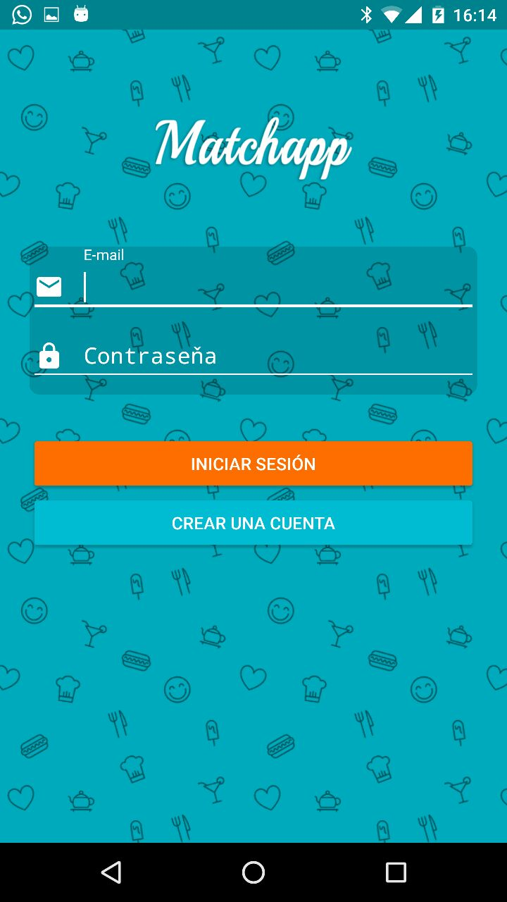
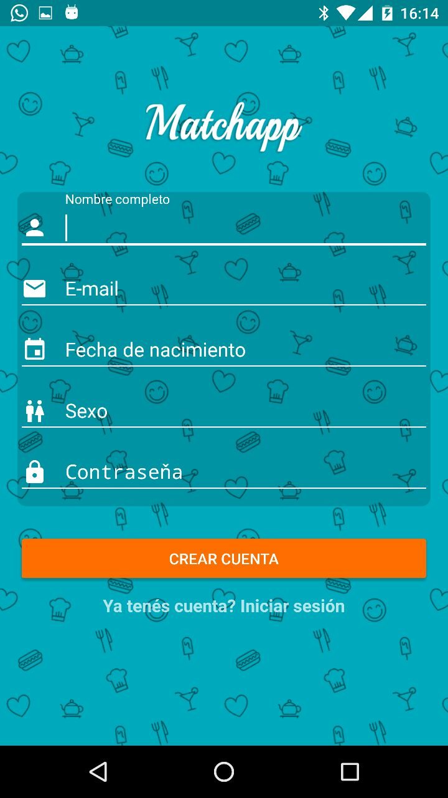
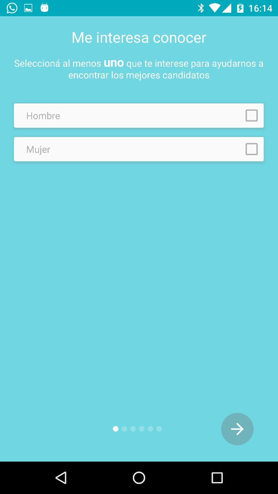
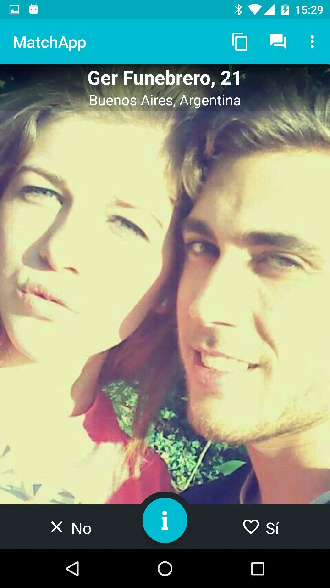
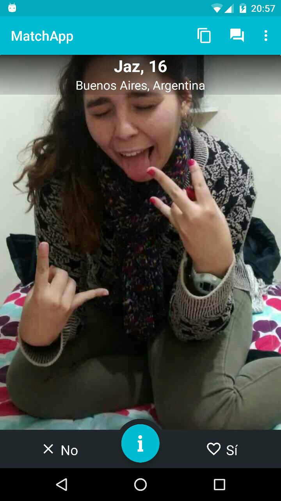
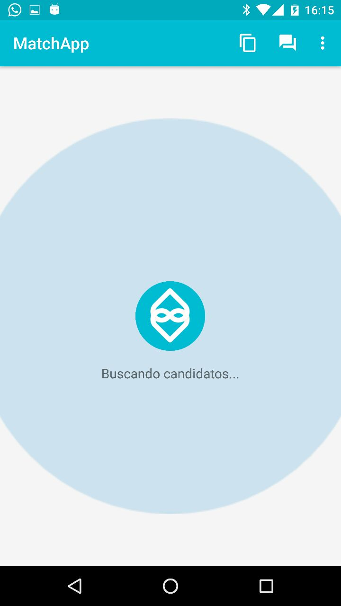
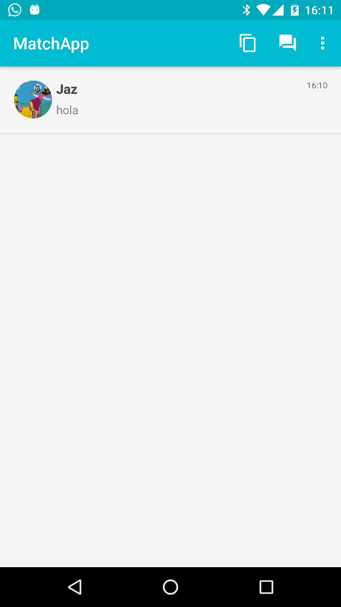
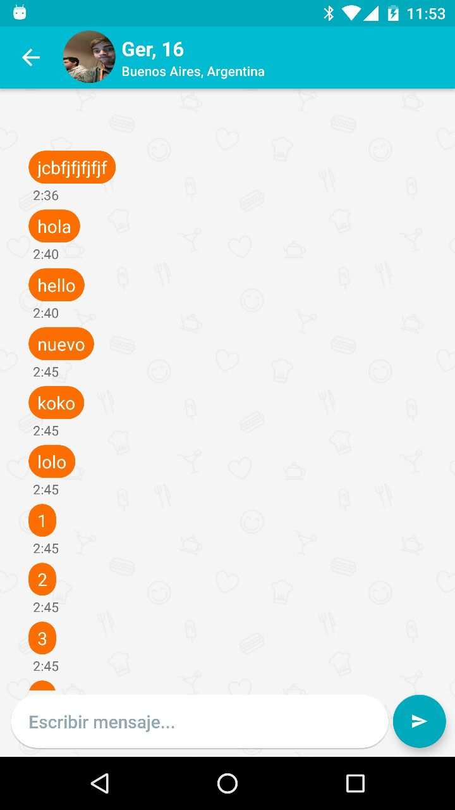

Manual de usuario
=================
Para utilizar la aplicacion, principalmente hay que descargarla y abrirla.

Home
----
Al abrir la aplicacion por primera vez se puede ver esta pantalla

Para iniciar sesion se debe llenar el campo Mail y Contraseña, pero para llenar esto, se debe primero crear un usuario. Tambien se puede iniciar sesion con facebook con lo que no haria falta crear un usuario.

Crear Usuario
-------------
Al apretar crear una cuenta, se ve este esta pantalla

Para crear la cuenta, se debe llenar el nombre, mail, fecha de nacimiento y contraseña. Finalmente, apretar Crear Cuenta y se creara la cuenta.
Luego apareceran pantallas como la siguiente donde se seleccionaran los intereses del nuevo usuario

Finalmente aparecera una pantalla para ingresar la foto de perfil y con esto finalizara la creacion de la cuenta.

Iniciar Sesion
--------------
Una vez que se dispone de una cuenta, se ingresan los datos y luego apretar Iniciar Sesion. Luego se ira a la pantalla de seleccion de candidatos.
Apareceran candidatos posibles de los cuales el usuario puede seleccionar o rechazar a quien quiera. Se acepta con el boton Si o desplazanto la imagen hacia la derecha, y se rechaza apretando No o desplazando la imagen hacia la izquierda. Las pantallas serian las siguientes

En el caso de no tener mas candidatos disponibles, el sistema buscara nuevos

Match
------
En caso de que el interes sea reciproco, aparecera una pantalla avisando que hay un match y se habilitara un chat como el siguiente

Chats
------
En el caso de tener un chat, se podra acceder a el desde la pantalla de chats, si se selecciona, se vera la siguiente pantalla por la cual se puede mandar mensajes a la otra persona

