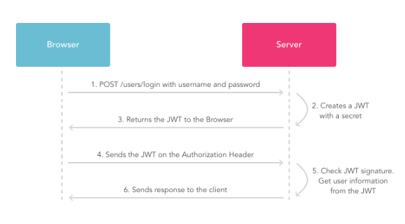

Autentificacion
===============
Para el proceso de autenticación se decidió utilizar un token bajo los parámetro JWT3. El Json Web Token es un standard abierta que define una manera segura de mandar mensajes a través de paquetes de json esta información puede ser verificada porque está firmada digitalmente. En este caso para hacer esta firma se usó un HMAC SHA256.

El JWT básicamente tiene 3 componentes:

* Header
* Payload
* Signature

El formato del mensaje es::

	Header.Payload.Signature

El formato del header consiste básicamente en un Json que tiene el tipo de token (jwt en este caso) y el algoritmo de hashing utilizado HMAC SHA256 en este caso. Para incluirlo en el mensaje se lo encodea en base 64, se hace lo mismo con el Payload y con el Signature.

En el payload hay una serie de claims que en este caso son el nombre del usuario y la fecha de expiración. Deberíamos incluir mas pero con este set básico el algoritmo funciona.

En el signature se crea un signature con la siguiente fórmula::

	HMACSHA256(  base64 UrlEncode(header) + "." +  base64 UrlEncode(payload),   secret world)

Secret world es la palabra secreta con la cual el algoritmo hasta el string que le damos. 
Para Finalizar agarramos los tres strings encodeados en base 64 y los concatenamos con puntos.

Asi funcióna la autenticación:

